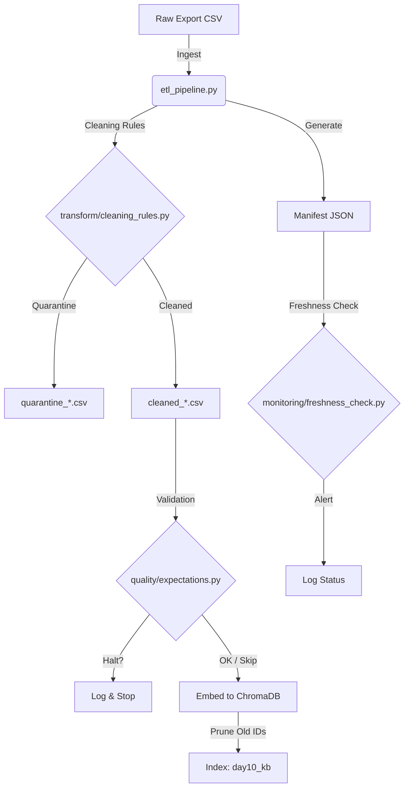

# Kiến trúc pipeline — Lab Day 10 (Nhôm 07)

**Cập nhật:** 2026-04-15

---

## 1. Sơ đồ luồng

> **Điểm đo:** Freshness được đo tại bước cuối cùng của pipeline bằng cách so sánh `latest_exported_at` trong Manifest với thời gian hiện tại. **Run_id** được ghi xuyên suốt Log, Manifest và Metadata của Vector Store.

---

## 2. Ranh giới trách nhiệm

| Thành phần | Input | Output | Owner nhóm |
|------------|-------|--------|--------------|
| Ingest | data/raw/*.csv | List[Dict] (Memory) | Ingestion Owner |
| Transform | List[Dict] raw | Cleaned CSV & Quarantine CSV | Cleaning Owner |
| Quality | List[Dict] cleaned | Expectation Results (Halt/Warn) | Quality Owner |
| Embed | Cleaned CSV | ChromaDB Collection (Upserted) | Embed Owner |
| Monitor | Manifest JSON | Freshness Status (PASS/FAIL) | Monitoring Owner |

---

## 3. Idempotency & rerun

- **Chiến lược:** Sử dụng `chunk_id` làm khóa chính. `chunk_id` được tạo ổn định bằng hàm băm (SHA-256) dựa trên `doc_id` + `chunk_text` + `sequence`.
- **Rerun:** Khi chạy lại cùng một dữ liệu, ChromaDB sẽ thực hiện `upsert` (cập nhật nếu trùng ID), không làm phình tài nguyên.
- **Pruning:** Sau khi publish, pipeline tự động quét và xóa các ID cũ không còn nằm trong file `cleaned` mới nhất, đảm bảo Index luôn là một Snapshot "sạch" của dữ liệu.

---

## 4. Liên hệ Day 09

- Pipeline này đóng vai trò là tầng **Data Preparation** chuyên nghiệp. 
- Corpus trong `day10_kb` có chất lượng cao hơn (đã fix stale policy, chuẩn hóa định dạng) so với việc nạp thẳng docs thô của Day 09. 
- Hệ thống Multi-agent Day 09 có thể chuyển sang sử dụng collection `day10_kb` này để trả lời chính xác hơn về chính sách hoàn tiền và nghỉ phép năm 2026.

---

## 5. Rủi ro đã biết

- **Manual Fix:** Một số rule fix (như 14 -> 7 ngày) vẫn đang dựa trên keyword hard-code. Nếu câu chữ trong Policy thay đổi quá nhiều, rule có thể bị sót.
- **Cold Start:** Nếu file raw hoàn toàn không có dữ liệu mới, pipeline sẽ HALT ở bước `min_one_row`.
